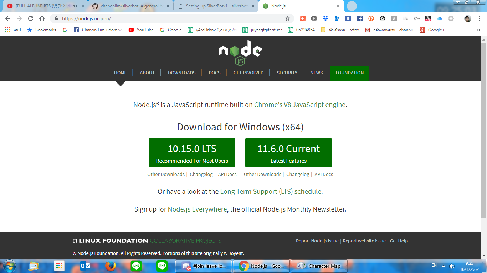

# Setting up SilverBotv1

## Getting Node.js

To install Node.js, go to [https://nodejs.org/](https://nodejs.org)

Click on the LTS version and install it.

## Getting ImageMagick

ImageMagick is utilized for image commands on this bot.

Download ImageMagick and install it from [here](https://imagemagick.org/script/download.php)

## Downloading SilverBotv1

Go to [https://github.com/chanonlim/silverbot](https://github.com/chanonlim/silverbot) and click on "Clone or Download".

Then, click on "Download ZIP". You should get a file named silverbot-master.zip

Extract it since we will need it for later steps.

## Setting Up SilverBotv1

### Making a Discord Bot account

In order for SilverBotv1 to work, you must set up a Discord Bot account.

First, go to [https://discordapp.com/developers](https://discordapp.com/developers).

Click on "Create an application" and give the app a name.

Give the app an avatar.

Then, go to "Bot", and click "Add Bot", then click "Yes, do it!". You should see this page.


I do **NOT** recommend you to turn on OAuth2 code grant if you just want to use this regularly unless you're a developer who is looking to link this with a web application.



Do **NOT EVER** share your token in **ANYWAY. EVEN THE ONES YOU TRUST.**


Take note of the token on this page by copying. We'll need it to set it up.

And we are pretty much done on Discord's side! Now it's for the real setup!

## Setting up SilverBotv1

Go into the extracted folder mentioned earlier. You should see an index.js file.

Run `npm install` to install the necessary dependencies. This step is important!

Then, run `npm start` . You should see the launcher after a while.


If a new update is available, you can install it first then run `npm start`again.


Then, choose "Configure SilverBot". Here's where we need our token.

When it asks for a token, put the token that you have earlier in.


If you enable guild join and leave notifications, you will be asked for a Channel ID to post it in. This ID can be retrieved by turning on Developer Mode, then right-click the channel that you want to send the messages to and click "Copy ID". 


After you've completed the setup, run `npm start`again. This time, choose "Start SilverBot w/ auto-restarts". The bot should start with an Invite URL. Copy the URL and paste it into the browser to invite it to a server.

And voila! You just finished setting up SilverBot and you can now use it!

